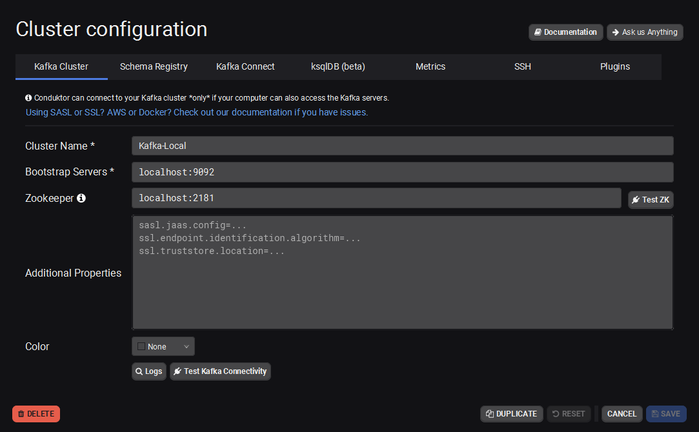

# Elixir + Apache Kafka

**TODO: Add description**

## Installation
```bash
git clone git@github.com:jpbrab0/kafka-elixir.git
mix deps.get
```

## Running
```bash
iex -S mix
> ElixirKafkaService.create_company(1, "teste")
```

Conduktor Cluster Configuration:

